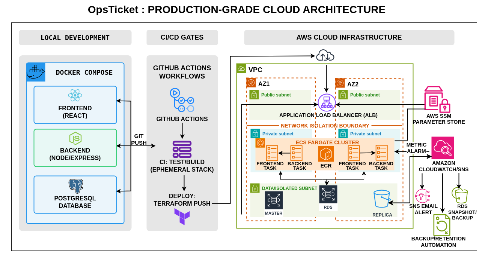

# OpsTicket — DevOps Portfolio Project

[](https://github.com)
[](https://www.docker.com/)
[](https://aws.amazon.com/)

## Overview

OpsTicket is a full-stack IT support ticket application I built to put my DevOps knowledge into practice. Instead of just writing code, I wanted to see what it takes to containerize an app, write CI/CD pipelines, and deploy it to AWS using Infrastructure as Code.

It is a working 3-tier application (React, Node.js, PostgreSQL) that handles user authentication and ticket management.

> 🎬 **Watch the 2-Minute Demo:** [Loom Demo Video](https://www.loom.com/share/a1a0fbe810c44eac880fb5b3b4b4d8ef)

## System Architecture

I designed the infrastructure to mimic a real-world AWS deployment, keeping security and isolation in mind.

<p align="center">
  
</p>

**How it works under the hood:**
- **Traffic Routing:** An Application Load Balancer (ALB) in public subnets takes incoming web traffic and routes it to either the frontend or backend based on the URL path.
- **Compute:** The React frontend and Node API run as Docker containers on AWS ECS (Fargate) in private subnets.
- **Database:** PostgreSQL runs on Amazon RDS, also in a private subnet. Only the ECS containers are allowed to talk to it via Security Groups.
- **Secrets:** Passwords and tokens are kept out of the codebase and injected at runtime using AWS SSM Parameter Store.

## Tech Stack

- **Cloud & Infrastructure:** AWS (VPC, ALB, ECS Fargate, RDS), Terraform
- **CI/CD:** GitHub Actions
- **Containers:** Docker, Docker Compose, Amazon ECR
- **Frontend:** React, Vite, Nginx
- **Backend & DB:** Node.js, Express, PostgreSQL, Knex.js

## The DevOps Highlights (What I Learned)

Here are the main DevOps practices I implemented in this project:

- **Infrastructure as Code (IaC):** Instead of clicking around the AWS console, I wrote Terraform scripts to build the VPC, networking, databases, and container services. This makes the environment reproducible and easy to destroy.
- **Automated CI/CD Pipelines:** I wrote GitHub Actions workflows (`.github/workflows/`) that trigger automatically. They run tests, build Docker images, push them to AWS ECR, and update the ECS services without downtime.
- **Passwordless AWS Auth:** Instead of storing long-lived AWS access keys in GitHub (which is a security risk), I configured GitHub OIDC. The CI/CD pipeline securely assumes an AWS IAM role for deployments.
- **Monitoring & Alerting:** I implemented monitoring to track application health and integrated email alerts to automatically notify me when issues are detected.
- **Dev/Prod Parity:** I used Docker Compose for local development so that running the app on my laptop closely matches how it runs in the cloud.
- **Database Management:** Using Knex.js, the database schema updates automatically when the containers start up. I also wrote a simple backup script (`scripts/backup-db.sh`) to automate data snapshots.

## Running It Locally

If you want to spin this up on your own machine:

1. Clone the repo:
   ```bash
   git clone https://github.com/Leospe24/ops-ticket-devops-lab.git
   cd ops-ticket-devops-lab
   ```
2. Set up environment variables:
   ```bash
   cp .env.example .env
   # You can leave the default values for local testing
   ```
3. Boot up the containers:
   ```bash
   docker compose up --build
   ```

The frontend will be available at `http://localhost`, the backend API at `http://localhost:3000`, and PostgreSQL is ready for connections.

## Deploying to AWS

If you want to deploy this to your own AWS account, you'll need Terraform installed and AWS credentials configured.

1. Navigate to the Terraform bootstrap directory to set up the remote state:
   ```bash
   cd terraform-bootstrap
   terraform init
   terraform apply
   ```
2. Once the state bucket is created, provision the main infrastructure:
   ```bash
   cd ../terraform
   terraform init
   # Review the plan before applying
   terraform apply
   ```

*(Note: You will need to update the Terraform backend blocks with your own S3 bucket name and configure GitHub Actions variables/secrets with your repository details for the CI/CD pipeline to work).*

## What's Next?

If I continue expanding this project, I plan to:
- Add an infrastructure scanning tool like Checkov or tfsec to automatically validate the Terraform code for security best practices.
